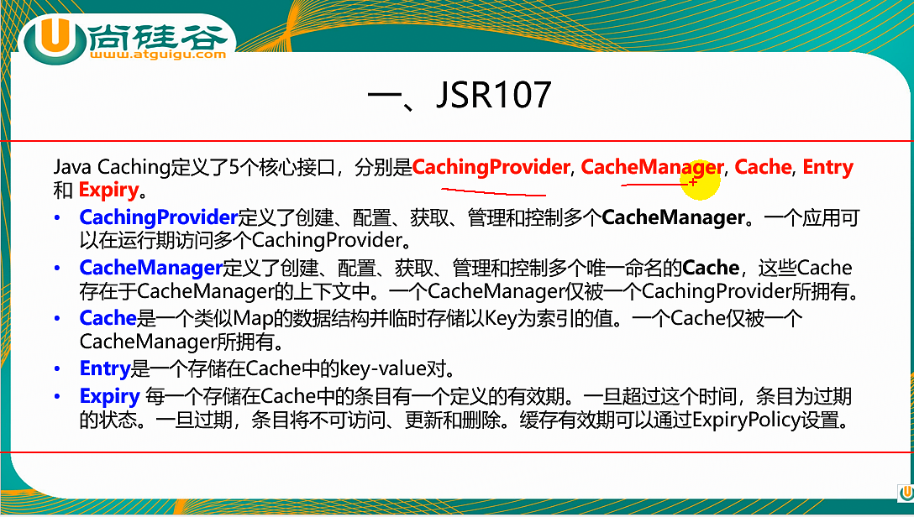
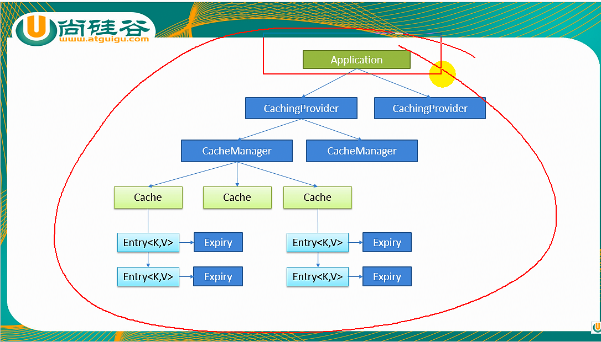
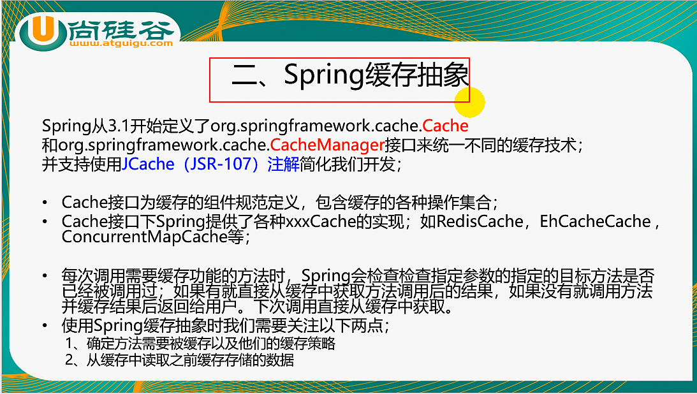
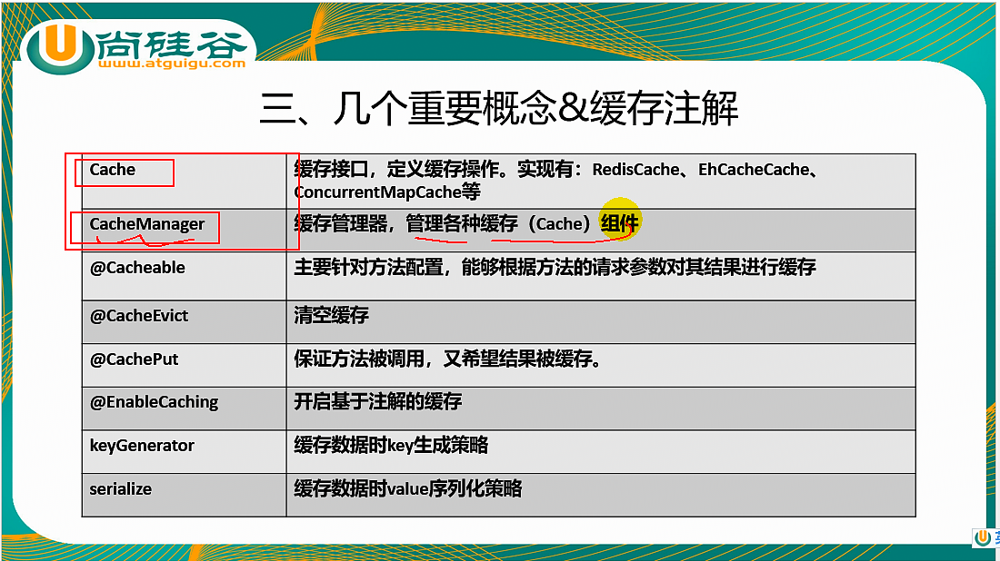
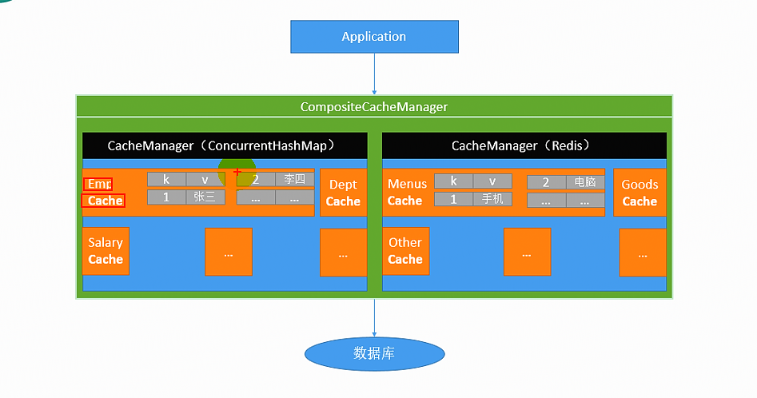
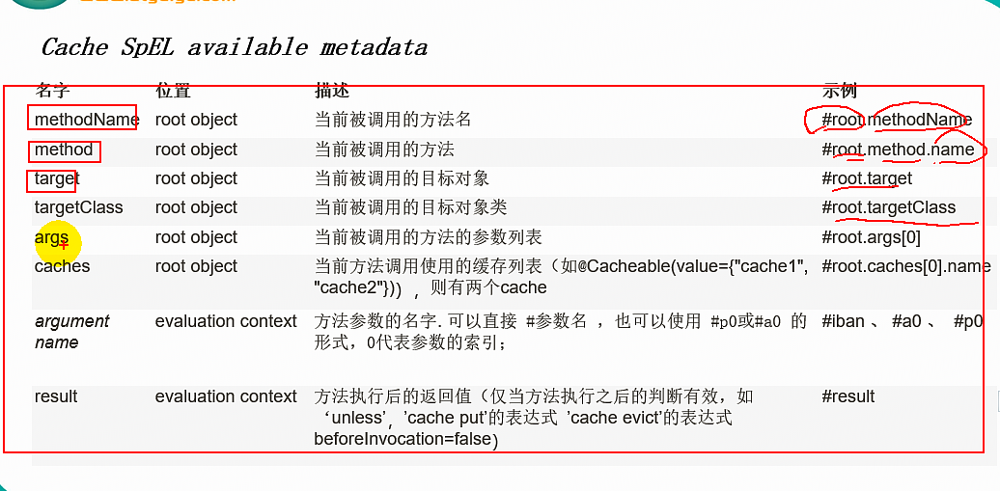
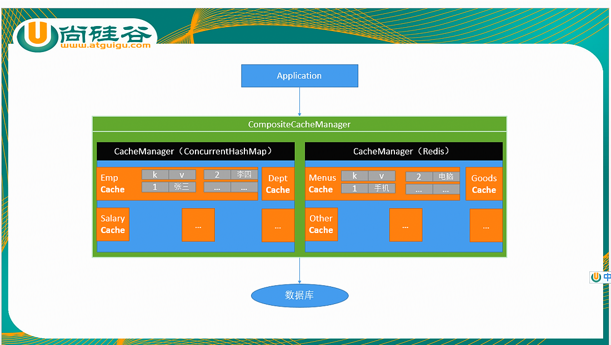

##1. Springboot 与缓存


- 上图的解释
- application先来访问CachingProvider
- 缓存提供者管理了多个CacheManager(缓存管理器)
- 缓存管理器才管理了多个Cache(缓存) 比如 Cache 1 缓存用户  Cache 2缓存部门
    缓存管理器和缓存的关系类似连接池和连接的关系
- 每一种不同的缓存





##2. 快速体验缓存
1. 开启基于注解的缓存
    - @EnableCaching
    - CacheManager管理多个Cache组件的,对缓存的真正操作CRUD是在Cache组件中的,每一个缓存组件
    自己唯一一个名字
2. 标注缓存注解即可
    - @Cacheable 可缓存
        - cacheNames/value: 指定缓存组件名字
        - key: 缓存数据时用的key；可以用它来指定。默认是使用参数的值 1-方法的返回值
        - keyGenerator: key的生成器：可以指定key的生成器组件id
        key和keyGenerator两个参数2选1使用
        - cacheManager: 指定缓存管理器
        - cacheResolver: 指定获取解析器,与上面的cacheManager 二选一
        - condition: 符合条件的情况下才缓存
        - unless: 否定缓存 当unless的条件为true,方法的返回值不会被缓存,可以获取结果进行判断
        - sync: 是否异步
    - @CacheEvict 清空缓存
        - allEntries: 清空缓存所有的数据
        - beforeInvocation: 默认是在方法之后清除缓存；如果出现异常，缓存不会清除
    - @CachePut 保证方法被调用，又希望缓存
    
3. 原理
    1. 自动配置类:CacheAutoConfiguration
    2. 缓存的配置类
        ```imports = {String[10]@4353} 
                    0 = "org.springframework.boot.autoconfigure.cache.GenericCacheConfiguration"
                    1 = "org.springframework.boot.autoconfigure.cache.JCacheCacheConfiguration"
                    2 = "org.springframework.boot.autoconfigure.cache.EhCacheCacheConfiguration"
                    3 = "org.springframework.boot.autoconfigure.cache.HazelcastCacheConfiguration"
                    4 = "org.springframework.boot.autoconfigure.cache.InfinispanCacheConfiguration"
                    5 = "org.springframework.boot.autoconfigure.cache.CouchbaseCacheConfiguration"
                    6 = "org.springframework.boot.autoconfigure.cache.RedisCacheConfiguration"
                    7 = "org.springframework.boot.autoconfigure.cache.CaffeineCacheConfiguration"
                    8 = "org.springframework.boot.autoconfigure.cache.SimpleCacheConfiguration"
                    9 = "org.springframework.boot.autoconfigure.cache.NoOpCacheConfiguration"    
        ```
    3. 哪个配置类默认生效SimpleCacheConfiguration 上面的是有序的
    4. 简单缓存源代码
    ```
       @Configuration
       @ConditionalOnMissingBean(CacheManager.class)
       @Conditional(CacheCondition.class)
       class SimpleCacheConfiguration {
       
       	private final CacheProperties cacheProperties;
       
       	private final CacheManagerCustomizers customizerInvoker;
       
       	SimpleCacheConfiguration(CacheProperties cacheProperties,
       			CacheManagerCustomizers customizerInvoker) {
       		this.cacheProperties = cacheProperties;
       		this.customizerInvoker = customizerInvoker;
       	}
        //注册了CacheManager ConcurrentMapCacheManager
       	@Bean
       	public ConcurrentMapCacheManager cacheManager() {
       		ConcurrentMapCacheManager cacheManager = new ConcurrentMapCacheManager();
       		List<String> cacheNames = this.cacheProperties.getCacheNames();
       		if (!cacheNames.isEmpty()) {
       			cacheManager.setCacheNames(cacheNames);
       		}
       		return this.customizerInvoker.customize(cacheManager);
       	}
       
       }
    ``` 
    5- 可以获取和创建 ConcurrentMapCache类型的缓存组件;他的作用是将数据保存在ConcurrentHashMap中。 
    6- 运行流程
    ```
        1.方法运行之前，先去查询Cache缓存组件，按照cacheNames指定的名字获取
            （cacheManager先获取相应的缓存）
        2.去Cache中查找缓存的内容，使用一个key，默认就是方法的参数；
            key是按照某种策略生成的 
            org.springframework.cache.interceptor.CacheAspectSupport.generateKey 
            默认使用SimpleKeygenerator
        3. 没有查询到缓存就调用目标方法；
        4. 将目标方法返回的结果，放入缓存中 
        总结 @Cacheable标注的方法执行之前先来检查缓存中有没有这个数据，默认按照参数的值作为key去查询缓存结果，
        如果没有就将运行的结果放入缓存
        
        默认生成key方法
        org.springframework.cache.interceptor.SimpleKeyGenerator.generateKey
        如果没有参数 key = new SimpleKey()
        一个参数     key = params[0]
        多个参数     key = new SimpleKey(params)   
    ```
##4 整合redis作为缓存
   1. 测试缓存
        原理:CacheManager === Cache缓存组件来实际给缓存中存取数据    
   - 引入redis的starter,容器中保存的 是RedisCacheManager;
   - RedisCacheManager 帮我们创建 RedisCache来作为缓存组件;RedisCache通过操作Redis缓存数据     
   - 默认保存数据k-v都是Object,利用序列化保存;如何保存json
        1. 引入了redis的starter,cachemanager变为RedisCachemanager
        2. 默认创建的RedisCachemanager
           

