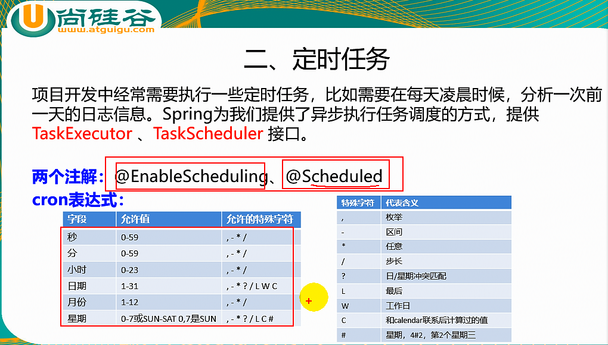
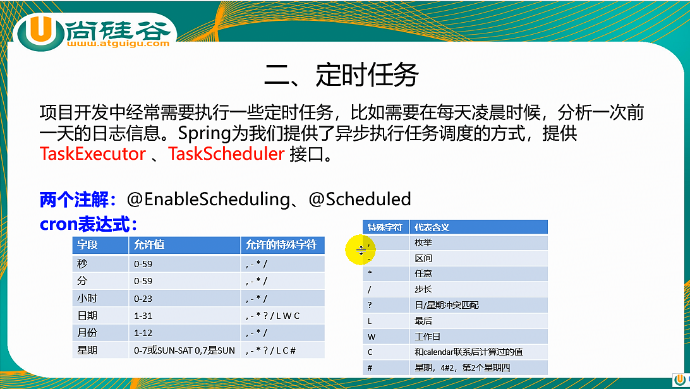

##1.延时任务
```
    //开启异步配置
    @EnableAsync
    @SpringBootApplication
    public class TaskApplication {
        public static void main(String[] args) {
            SpringApplication.run(TaskApplication.class, args);
        }
    }
    
    @Service
    public class AsyncService {
        //异步方法
        @Async
        public void hello(){
            try {
                Thread.sleep(3000);
            } catch (InterruptedException e) {
                e.printStackTrace();
            }
            System.out.println("处理数据中。。。");
        }
    }

```
##2.定时任务


